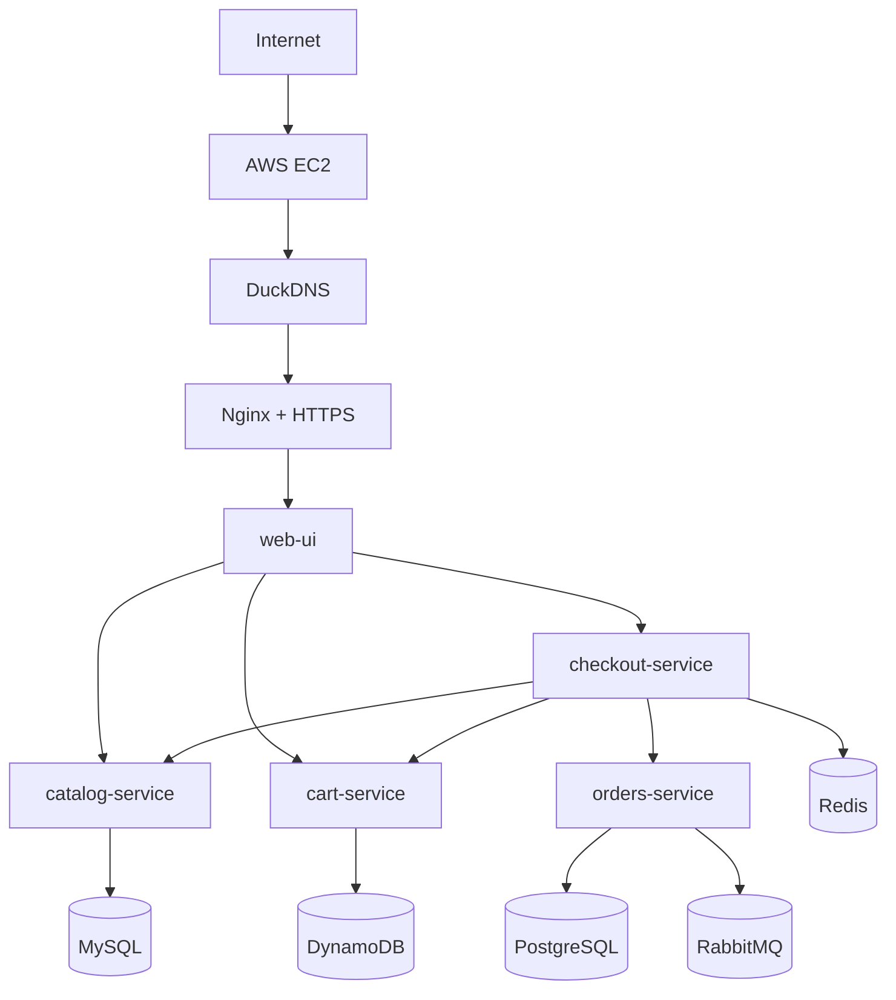

# 🛒 Microservices E-Commerce (Projet DevOps)

Projet personnel autour d’une application e-commerce basée sur une architecture microservices, déployée sur AWS avec une approche DevOps complète.

⚠️ Ce projet est un environnement de démonstration visant à illustrer une architecture microservices et un déploiement DevOps. Certaines logiques métier (authentification, gestion stricte du stock) ne sont pas implémentées.

---

## 🚀 Démo

👉 https://fred-microservices.duckdns.org

---

## 🏗 Architecture




L’application est composée de plusieurs services :

* **web-ui** : interface utilisateur (Flask)
* **catalog-service** : gestion des produits (MySQL)
* **cart-service** : gestion du panier (DynamoDB)
* **checkout-service** : orchestration de la commande (Redis)
* **orders-service** : gestion des commandes (PostgreSQL)

Le tout est orchestré avec **Docker Compose** et exposé via **Nginx** en HTTPS.

---

## ⚙️ Stack technique

* Python (FastAPI, Flask)
* Docker / Docker Compose
* AWS EC2
* Terraform (Infrastructure as Code)
* Nginx (reverse proxy)
* Let’s Encrypt (HTTPS)
* GitHub Actions (CI/CD)
* Redis / RabbitMQ / MySQL / PostgreSQL / DynamoDB

---

## ☁️ Déploiement

L’application est déployée sur une **instance EC2 AWS provisionnée avec Terraform**.

Le processus est le suivant :

* Provisionnement de l’infrastructure avec Terraform
* Déploiement des services via Docker Compose
* Configuration de Nginx en reverse proxy
* Mise en place du HTTPS avec Let’s Encrypt

⚠️ L’instance EC2 est temporaire et pourra être détruite après utilisation (`terraform destroy`).

---

## 🔄 CI/CD

Un pipeline GitHub Actions permet de :

* Build les images Docker
* Push sur Docker Hub
* Déployer automatiquement sur l’instance EC2 via SSH

À chaque `git push`, l’application est mise à jour automatiquement.

---

## 🐳 Lancer le projet en local

Cloner le repo :

```bash
git clone https://github.com/Whitedukecmr/microservices-ecommerce.git
cd microservices-ecommerce
```

Lancer l’application :

```bash
docker compose up --build
```

Accès :

```text
http://localhost:8080
```

---

## 📁 Structure du projet

```text
microservices-ecommerce/
├── web-ui/
├── cart-service/
├── catalog-service/
├── checkout-service/
├── orders-service/
├── terraform-aws-ec2/
├── docker-compose.yml
├── docker-compose.prod.yml
└── .github/workflows/
```

---

## 🎯 Objectif du projet

Ce projet m’a permis de :

* mettre en place une architecture microservices
* travailler avec Docker et Docker Compose
* automatiser un déploiement avec GitHub Actions
* provisionner une infrastructure AWS avec Terraform
* exposer une application en HTTPS

---

## 👨‍💻 Auteur

Fréderic Junior EPESSE PRISO
Alternant en systèmes, réseaux et cloud computing